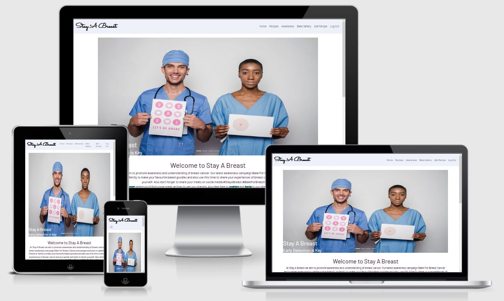
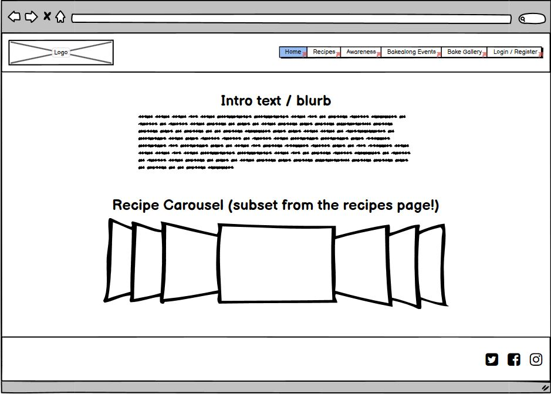
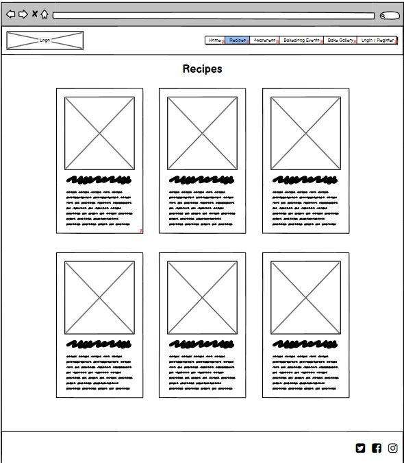
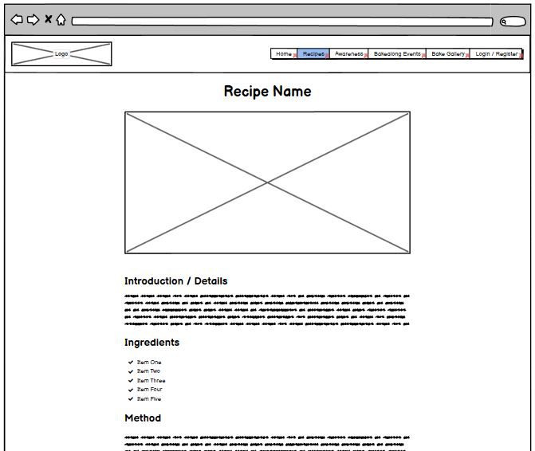
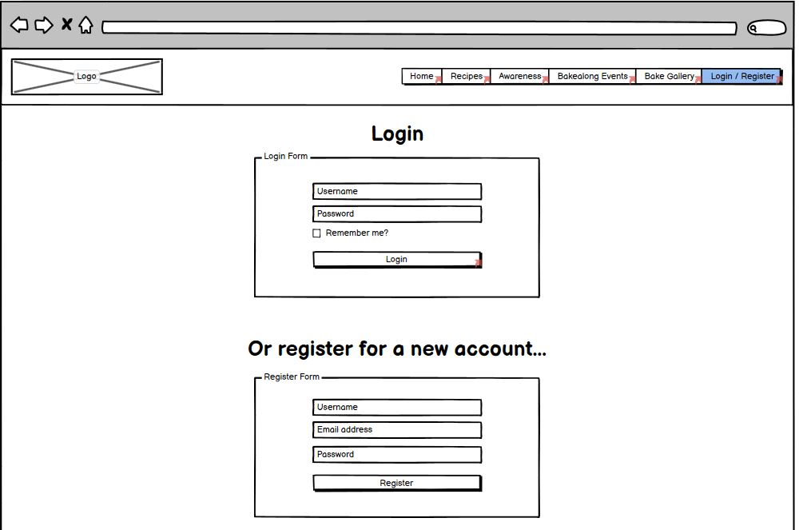
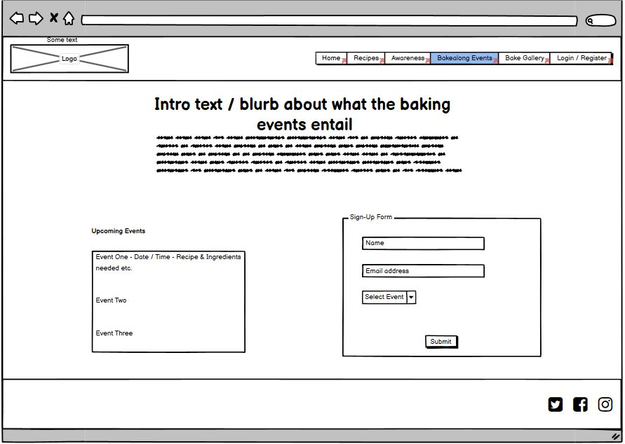

# Project Title

[Stay A Breast](http://stay-a-breast.herokuapp.com/index)

## Introduction

Stay A Breast is a website for breast cancer awareness aimed at bringing people together over breast cancer and baking. Stay A Breast will provide a platform for users to share recipes with other users, and promote baking with others, hopefully while discussing breast cancer. The site will also provide information on breast cancer prevention and detection, giving users something to talk to their fellow bakers about, including information on how to perform self checks, and where to go for further information.

Users will be able to register for the website, login and share recipes for fellow bakers, supported by MongoDB.

## Wireframes

Home page:

Recipes main page page wireframe

Recipes individual page wireframe

Login and Register page wireframe

Events wireframe (future implementation)

## Features

### All pages

Responsive navigation bar for ease of use on all viewports.

Links are underlined when hovered over to indicate that they are clickable, and Logo redirects to Home page.

Favicon on title bar.

Footer with clear links to socials.

### Home page

Eyecatching carousel.

Introductory text highlighting the purpose of the website.

Links to 'Login', 'Register' and parts of the 'Awareness' page all provided within the Home page text, to promote further interaction.

### Recipes page

Preview cards to display recipes that users have submitted, including image. Each card clicks through to it's own page.

User images formatted to a uniform size.

### Individual recipes pages

Individual recipe page with full details from user, stored in MongoDB.

Full photo, followed by Ingredients and Method clearly laid out.

Username of site user who submitted the recipe is included, the make the user feel as though they have contributed to the site.

### Awareness page

Clearly and concisely presented information, from official sources.

Page broken into sections each with it's own heading and link, to make the information easily digestible.

Each section has a 'Back to top' link for ease of navigation.

### Bake Gallery page

Images from user's own baking projects.

### Login/Register pages

Form for registering and a form for logging in. Includes feedback messages.

When user has logged in, the navigation bar will change from 'Login' to 'Logout'.

### Future features

Events page - events calendar and form for users to submit their own events.

Gallery page - currently owner submitted images, in the future this will be user photos.

Profile page - for user to see any recipes, events and images that they have submitted.

## Technologies Used

HTML5
CSS
Python 3
MongoDB
Flask
Bootstrap
Googlefonts
Gitpod
Github
Heroku
Fontawesome

## Validator Testing

## Unfixed Bugs

## Deployment

This website was created in the Gitpod development environment. After creating a new repository in GitHub using the Code Institute template, the green Gitpod button was used to initialise the repository in Gitpod. Throughout the process the git commands git add and git commit were used to store the work in the local Gitpod environment, git push would then be used to push the commits to the GitHub repository. From here the website could then deployed via Heroku.
Heroku Deployment

Before creating the application in Heroku,

    Create a requirements.txt file in your work environment by running the following command in the command line interface:

    pip3 freeze —local > requirements.txt

This will save all the dependencies currently used by the app to the requirements.txt file.

    Create a Procfile, which tells Heroku which file runs the app and how to run it. To do this run the following command in the CLI:

    echo web: python app.py > Procfile

    Git add, git commit and git push these files to GitHub so they are available to Heroku which will use them to build the app.

In Heroku

    Login and click New -> Create New App
        Add a name
        Select region
        Click Create App

    Select Connect to GitHub, when the Github profile is displayed add the name of your repo and click search, once it finds & displays the correct repo click connect.

    Set up the config vars required to run the app. In the Settings Tab click Revel Config Vars

    Create the following variables and assign their values: IP, PORT, SECRET_KEY, MONGO_URI, MONGO_DBNAME
    Click Hide Config Vars

    In the Deploy Tab
        Click Enable Automatic Deploys
        Select the branch the repo is using
        Click Deploy Branch => Your app was successfully deployed will be displayed with the option to view the app.

Creating A Local Clone

You can clone the repository to create a local copy on your computer.

From the Git Hub repository:

    Click Code at the top of the file list
    Click the clipboard icon to copy the url provided

Open terminal:

    Change the current working directory to where you want the cloned directory to be
    Type git clone and paste the copied url after it
    Press enter and the clone will be created

## Credits

HTML for Bake Gallery from Tutorials Tonight: https://www.tutorialstonight.com/bootstrap-image-gallery.php
Code for sticky footer from CSS Tricks: https://css-tricks.com/couple-takes-sticky-footer/
Images on gallery and recipes page from Pexels and Wikimedia Commons.
All information on the Awareness page from The National Breast Cancer Foundation https://www.nationalbreastcancer.org/

